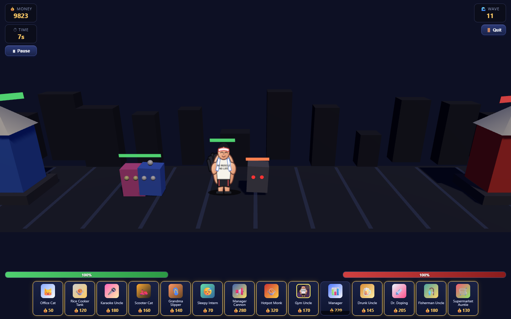
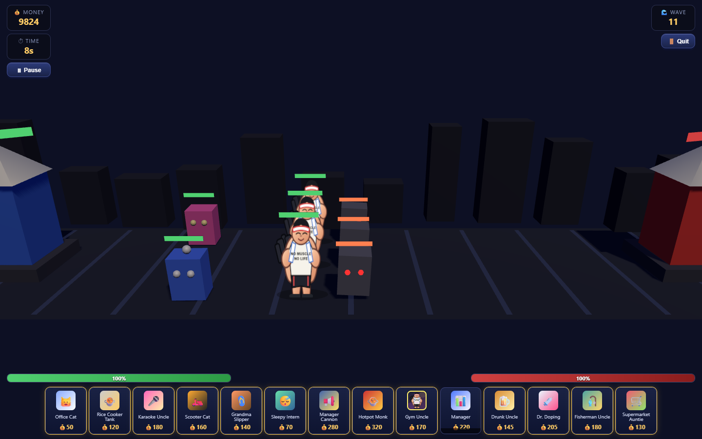

# Day 1: contact combat and formation

Addresses #26. These are actual game captures at 1440×900, using the unchanged
camera, approved Gym Uncle sprite and HUD. The comparison deploys three Gym
Uncles against three Angry Printers, with Karaoke Uncle and Manager behind.
For a repeatable eight-second skirmish, combatant HP is raised to 50,000 and
automatic waves/comedy interactions are disabled in the capture only. Production
stats, wave code, art and effects are unchanged. This is a combat comparison,
not proof of a full campaign playthrough.

| Main (`7714182`) | Day 1 |
| --- | --- |
|  |  |

Before: all three Gym Uncles stood at the same X/Z coordinate and enemies piled
onto the same line. After: persistent depth slots at Z = 0, -1.8, +1.8 make the
three combatants and their HP bars distinguishable. X remains the march axis;
existing weapon ranges provide frontline/backline gaps, while allies sharing a
column queue with body-size spacing. Depth is a shallow formation, not a new
three-lane targeting game. The perspective camera can still visually occlude
parts of tall sprites even when their ground footprints are separate.

## Implementation

- `FormationSystem` assigns stable per-battle IDs, role-biased slots and smooth
  depth changes. A blocked reinforcement can move into a clear depth slot.
- Both entities pass ordinary movement and knockback through swept ground
  contact checks. Living opposing ground units block advancement across the
  shallow lane, including long frame steps. Death releases the obstruction.
- Attack acquisition still measures along X and handles crossed opponents.
  Large body radii extend contact reach just enough to avoid embedding small
  melee in bosses. Damage, cooldowns and base attack range are unchanged.
- In-range taunt retains priority; an out-of-range taunter no longer makes an
  enemy ignore an adjacent blocker. Enemy knockback decay is frame-rate based.
- Active dash and flight bypass ground spacing intentionally. Dash travel is
  limited to its remaining duration and checks hits along its entire segment.
- No save-format, economy, wave, stage, sprite, animation or VFX replacements.

## Verification

Run `npm run test:unit` and `npm test` separately. The browser suite uses actual
Three.js entities and the production methods, not mock combat implementations.
It verifies opposing melee damage, large frame steps, stable 3v3 slots, real
ranged/support projectile hits, survivors destroying either base, victory and
defeat callbacks, crossed targets, taunt, dash, flight, knockback, large bosses,
Gym Uncle's texture and .62 speed, pause/resume, and no Bōken/campaign reward or
unlock on defeat. It also retains the existing UI deployment/save smoke path.

The browser must be able to load the existing Three.js CDN import. If Playwright
or its browser is missing the test exits with an error; it does not silently skip.

## Limits for review

- Slot spacing is a small deterministic lane solver, not general navigation.
  Very large crowds pressed against a base need further stress/play testing.
- Tall billboard sprites can overlap in screen projection; physical spacing
  does not guarantee every pixel of every character is visible.
- Normal combat uses the existing sequential entity update order. This is not
  a lockstep multiplayer simulation. Dash intentionally permits crossing.
- The targeted scenarios and browser smoke are not an all-stage campaign soak
  test or a commercial-release readiness claim.
