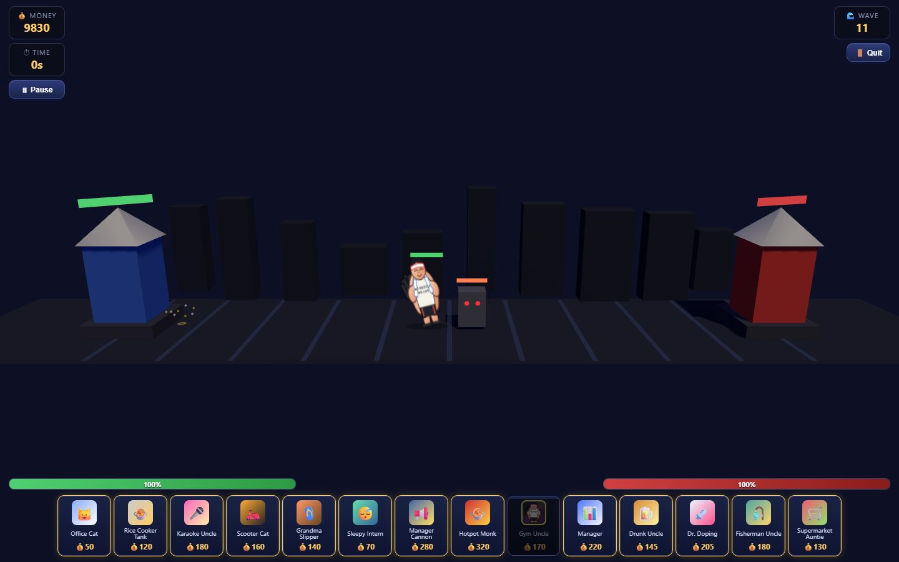
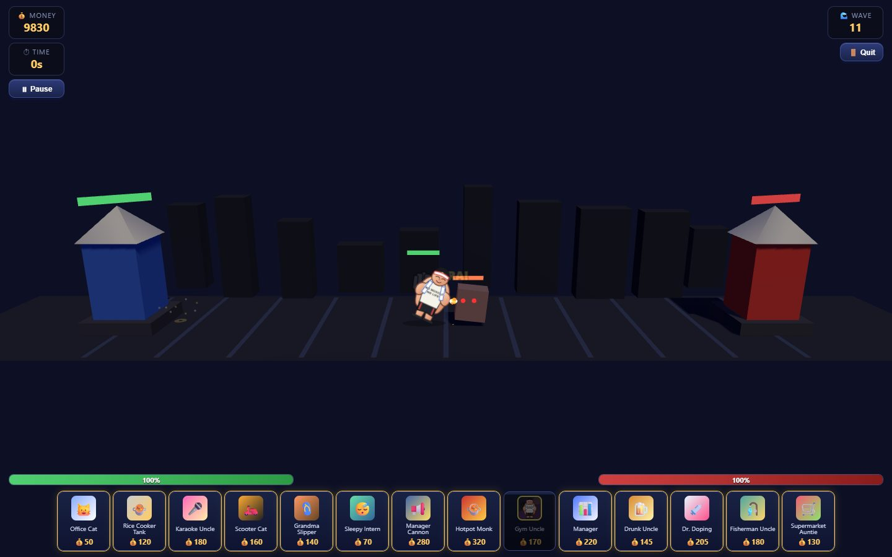
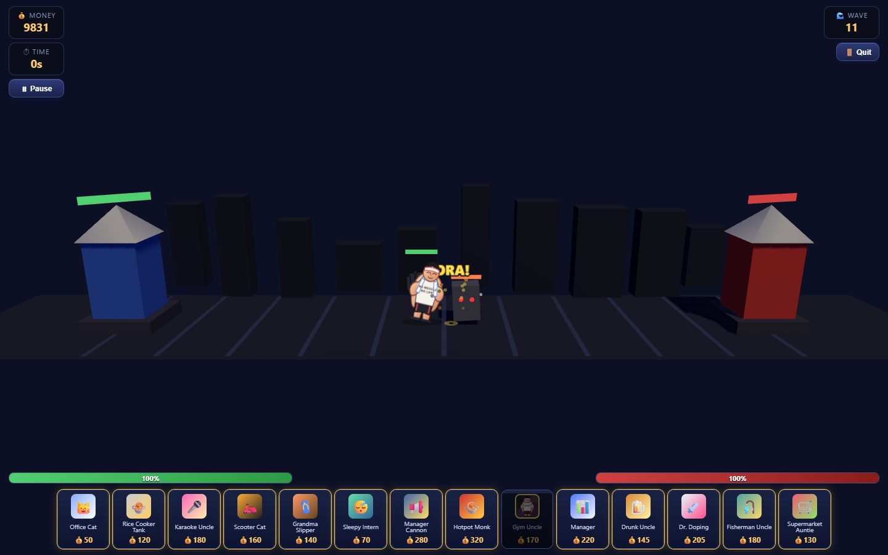

# Day 2 — timed contact and readable impact

Implements Issue #29 from main `b832b5f`. Day 1 formation/collision code, character
art and stats, stage definitions, economy and save/progression code are retained.

## Before / after

Previously, normal attacks damaged or fired immediately and then played an
independent animation timer. Hit reactions and walking could overwrite poses;
Gym's billboard did not inherit visible in-plane rotation from its parent group.
The same projectile hit also requested sparks from several places.

Now `AttackTimeline` owns a single pending attack. Gym anticipates for 0.28 s,
holds strike for 0.08 s and recovers for 0.28 s. Damage/release is emitted once
at contact. Its 0.72 attacks/s and 0.62 movement speed remain configured as before;
the first hit now has the intentional windup. Normal enemy/procedural attacks
use shorter timing. Boss skills wait for a free timeline and anticipate too.
Their skills can be postponed by an ongoing attack/recovery instead of overlapping
the pose. No attacks are queued to catch up after a long frame.

Death, stun and scene exit cancel pending attacks. Pause advances no simulation
time. Invalid targets are replaced only by a living target already in range;
otherwise the swing misses and recovers. Projectiles cause damage on arrival.
Already released projectiles remain in flight if their owner dies; unreleased
delayed boss-volley shots are canceled on death/stun.

`CombatPose` applies the loaded lean, accelerated downswing, contact compression
and weighted recovery to the existing sprite. `SpriteMaterial.rotation` makes the
lean actually visible. Hit recoil is subordinate to attack contact; local enemy
material feedback and base tower recoil/flash happen at damage. Death still uses
the existing immediate removal/burst, not animated death frames. Shared character
textures stay cached when one unit dies.

`CombatImpact` provides one damage-feedback route and uses the facing base wall
at X = +/-9.18, Y = 1.15, with bounded depth. Spark positions on regular enemies
sit on the visible near edge. Damage amounts, status applications and splash
falloff are retained; direct splash arrival at a base always includes that base.

## Actual browser captures

These render the real BattleScene and actual entities. Capture-only setup moves
actors into contact, raises troop HP to 50,000 and disables automatic waves and
comedy interactions. Base HP and attack values are unchanged. Random scenery and
particle directions remain random. The capture script is in `tests/capture-day2.mjs`.

| Anticipation | Contact (58 damage) | Recovery |
| --- | --- | --- |
|  |  |  |

| Scenario | 1440 × 900 | 960 × 540 |
| --- | --- | --- |
| Gym versus enemy | [capture](enemy-contact-1440.jpg) | [capture](enemy-contact-960.jpg) |
| Gym versus base | [capture](base-contact-1440.jpg) | [capture](base-contact-960.jpg) |
| 3v3 simultaneous strikes | [capture](3v3-contact-1440.jpg) | [capture](3v3-contact-960.jpg) |

Both bases are framed by the adjusted resting camera. At short viewport heights,
deployment uses one compact row (horizontal scroll when necessary) so cards do
not cover the combat strip. HP bars/shadows remain on the owners. Tiny stable
sprite-only X offsets and transparent render order improve depth readability;
formation positions, targeting and collision physics are untouched.

## Timing and effect evidence

The instrumented real-scene [trace.json](trace.json) records attack start at
0.0167 s, contact and a single 58-damage impact at 0.3000 s, and `phase: strike`
on that captured frame at both resolutions. The browser regression additionally
asserts recovery, no duplicate damage and successive start intervals within
0.035 s of 1 / 0.72. Its stationary-target trace starts at 0.0167, 1.4033 and
2.7867 s; impacts occur at 0.2967, 1.6867 and 3.0700 s. These are simulation
timestamps, not a claim that screenshots alone prove temporal correctness.

Presentation limits: 96 live particles, 4 rings, 1 text; burst emission permits
48 particles / 3 rings / 1 text, refilling at 64 / 4 / 0.8 per second. Excess
effects are skipped before geometry/material/texture allocation; damage is never
skipped. Camera impacts have a 0.16 s retrigger limit (a stronger tier can upgrade
the current beat). Light, heavy, base and boss feedback stay local/restrained.
Projectile point lights were removed to prevent crowded volleys causing flicker.

The [20-actor capture](stress-20-1440.jpg) profiles 179 requestAnimationFrame
intervals: median 17.2 ms, p95 18.2 ms, peak 51 transient effects and 1 text.
This is a short automated Chromium sample on this machine, including march and
combat, not a long performance soak or a universal 60 FPS guarantee.

## Validation

- `npm run test:unit`: PASS, all 9 suites, including deterministic timeline,
  interruption, dt-spike, target validity, no-queue, effect-budget and camera tests.
- `npm test`: PASS: all 10 Day 1 scenario groups and 9 Day 2 groups. Includes real
  projectile arrival, boss skill cancellation, both base impacts, shared texture
  lifetime, actual pause-button/resume and scene exit with a pending attack.
- `node tests/capture-day2.mjs`: PASS; captured and visually inspected both sizes,
  contact poses, bases, 3v3 and the crowd sample. Visual inspection led to the
  billboard rotation and short-viewport HUD fixes.
- `git diff --check`: PASS.

Tests used the existing Playwright installation with
`PLAYWRIGHT_CHROMIUM_EXECUTABLE` pointing at installed Chromium 1223. No package
dependency/lockfile changes. One Day 1 crossed-target assertion now waits through
windup and additionally asserts no premature damage; the crossing test remains.

## Limits

- One approved static sprite with pose curves; no new frame art, atlas, rig,
  independently articulated arm or weight. Tall sprites can still occlude each
  other in projection. Attack direction of the artwork is still right-facing.
- Initial hits and boss skill releases now have deliberate anticipation; nearby
  target movement can make an attack miss. Long fights/campaign balance need
  human playtesting beyond the tested stationary cadence and scenario regressions.
- Effects may be dropped in crowds by design; hit reactions/HP changes still
  identify actual damage. No audio was added (deferred to the later audio pass).
- Tests cover targeted cases, not every stage played end to end or a long soak.
