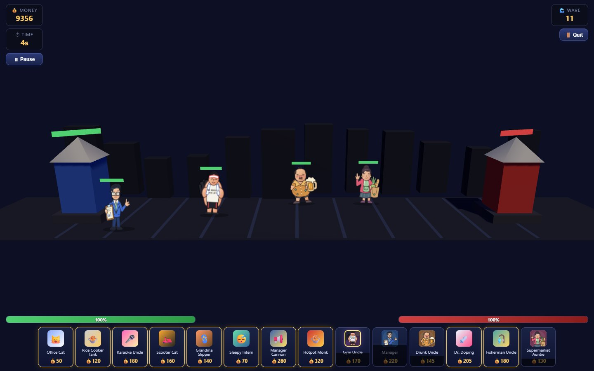
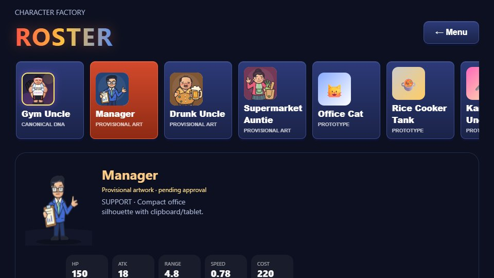

# Day 3 — provisional character art in the existing game

Implements Issue #32 from main `a92717e`, following the merged Day 1/Day 2 work.
All three new designs are **provisional, pending the user's visual approval**.
This extends the existing CharacterFactory and six canonical DNA entries; it
does not introduce a replacement factory, game or roster.

## Before and after

Before, Manager, Drunk Uncle and Supermarket Auntie were playable procedural
shapes with emoji UI. Only Gym Uncle had real battle/portrait artwork. Sprite
loading had no visible failure handling, and the roster preview built a separate
procedural model even for Gym.

Now six original SVG files provide transparent battle art and matching portraits:
Manager has a narrow blue office suit, spectacles, pointing hand and clipboard;
Drunk Uncle has a round loose-shirt silhouette, flushed face and oversized amber
mug; Auntie has a high bun, apron/skirt, raised bargaining hand and a grocery bag
with leek, bread, carrot and cabbage. The approved Gym SVG files and its DNA are
unchanged, including speed 0.62, damage 58, attack rate 0.72 and Day 2 timing.

DNA carries local art URLs, dimensions, bar position, preset, provisional status
and ranged prop origin through CharacterFactory. Validation rejects malformed
metadata while legacy characters retain their defaults. The real battle Unit,
deployment portraits and roster all use this config. The selected roster actor
uses an actual Unit preview in a scoped renderer viewport, including idle motion
and the same fallback/texture lifecycle. The first four roster cards show the
four illustrated actors; all original playable IDs remain available.

Each actor owns its material and local geometry. Loaded textures are shared for
the application session. Loading/broken battle images show the existing colored
procedural body; broken portraits show the existing icon. Death/scene exit
unsubscribes pending loads and disposes local resources once, leaving shared
textures intact. Failed loads can retry on a later deployment.

## Real browser evidence

| Scenario | 1440 × 900 | 960 × 540 |
| --- | --- | --- |
| Four characters marching | [capture](march-1440.jpg) | [capture](march-960.jpg) |
| Four characters versus three printers | [capture](battle-1440.jpg) | [capture](battle-960.jpg) |
| Four roster portraits and Manager preview | [capture](roster-1440.jpg) | [capture](roster-960.jpg) |

Reproduce with `node tests/capture-day3.mjs`. These are real BattleScene/RosterScene
renders, not composited illustrations. Capture setup gives both sides' troops
5,000 HP, disables automatic waves/comedy, fills the bank and places the troops
near combat to keep everyone visible. Stats in production are unchanged. The
march view then clears opponents and repositions the same living units across
the field for an unobstructed art inspection. The displayed wave value is the
fixture HUD, not proof of completing those waves. Random scenery/idle phases vary.

The [trace](trace.json) records actual simulation event times plus pose-state
transitions (body position, billboard rotation, scale) at both sizes. New
characters keep Day 2's 0.10 s windup / 0.05 s strike / 0.13 s recovery; Gym keeps
0.28 / 0.08 / 0.28. Manager/Auntie release at contact, with damage on projectile
arrival. Drunk/Gym damage at melee contact. No second damage source was added.

Visual inspection found a roster text overlap and heavy occlusion of Drunk by
Gym. The label spacing was corrected; the three new sprites now use a stable
presentation-only depth offset, with bars/shadows/prop origins following it.
Ground anchors, Day 1 formation/collision and Gym's rendering offset are unchanged.
The roster preview no longer shows a dim duplicate behind the detail text.

## Validation

- `npm run test:unit`: PASS, 10 suites. New checks cover all eight art references,
  SVG structure, locked Gym hashes, metadata errors/defaults and unchanged stats.
- `npm test`: PASS. All 10 Day 1 groups and 9 Day 2 groups remain. Six Day 3
  groups run at both 960×540 and 1440×900: real HUD deployment/costs/cooldowns,
  decoded art/bars, three repeated scene cycles, unique materials/shared textures,
  visible broken/missing image fallbacks, late-load cancellation/idempotent
  cleanup, all four contact/recovery/death paths, mixed 3v3 spacing and damage,
  advance and both base sieges, roster preview/portraits and save compatibility.
- `node tests/capture-day3.mjs`: PASS; all six images inspected. No browser
  console/page errors during the capture or browser regressions.
- `git diff --check`: PASS. No runtime dependency or lockfile changes.

Tests use the installed Playwright/Chromium 1223 with
`PLAYWRIGHT_CHROMIUM_EXECUTABLE`. No Day 3 frame-rate benchmark was performed;
the Day 2 performance sample is not presented as a Day 3 measurement.

## Remaining limits and Day 4 handoff

- These are single static images with code-driven lean/sway/squash, not frame
  animation, articulated arms or a rig. Death remains immediate removal/VFX.
  Manager/Auntie retain the existing generic projectile meshes. New skill names
  in DNA are concepts; no new support aura, bag charge or hidden skill is claimed.
- Billboard edges/props can still overlap in crowded screen projection,
  particularly behind enemies. Ground collision prevents physical crossing;
  it cannot make every pixel visible. The extra march view exposes all artwork.
- Roster details scroll vertically at 960×540; all four portraits remain visible
  in the initial viewport. Other ten units retain their existing procedural art.
- Successful textures remain cached until page teardown (four battle textures
  for this cast). This is a short targeted lifecycle test, not an all-stage soak
  or GPU memory/performance certification.
- Next: user art review first, refine approved silhouettes/prop contact if
  requested, then prioritize a measured crowd/readability pass. Add actual
  frames/audio only as a separately approved scope. See the reusable
  [production template](../../production/CHARACTER_TEMPLATE.md).
